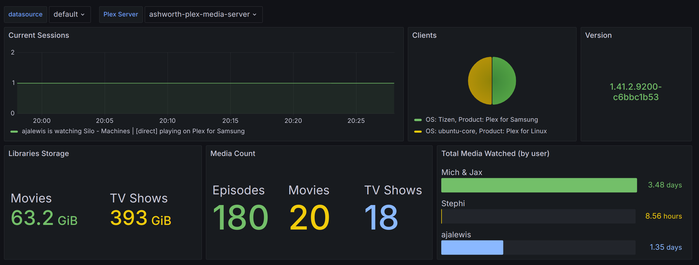

# Prometheus Plex Media Server Exporter

## Usage

### Architectures

| Architecture   | Supported?       
| -------------  | ------------- 
| **x86-64**     |       ✅      
| **arm64**      |       ✅ 

### CLI

```
usage: Plex Media Exporter [-h] [-t TOKEN] [-s SERVER] [-p PORT] [-v]

Plex Media Server Prometheus exporter

options:
  -h, --help            show this help message and exit
  -t TOKEN, --token TOKEN
                        Plex token
  -s SERVER, --server SERVER
                        Plex server baseurl (default: http://localhost:32400)
  -p PORT, --port PORT  Metrics server port (default: 9922)
  -v, --version         Show program's version number and exit
```

### Docker

```
docker run \
    -e PORT=9922 \
    -e PLEX_SERVER=http://localhost:32400 \
    -e PLEX_TOKEN=<PLEX_TOKEN> \
    -p 9922:9922 \
    ajalewis/plex-media-server-exporter:latest
```

### Helm Chart

See Helm install [folder](https://github.com/ajalewis/plex-media-server-exporter/tree/main/charts/plex-media-server-exporter)

### Environment Variables

The Plex Media Exporter uses the below environmental variables:

| Environment variable       | Default       | Description |
| -------------------------- | ------------- | ----------- |
| `PLEX_SERVER`         |  http://localhost:32400             | Plex Media Server hostname |
| `PLEX_TOKEN`         |              | Plex Media Server token |
| `METRICS_PORT`         |   9922            | Prometheus metrics port |


## Metrics


| Metric name                 | Type     | Description                                                 | 
| ----------------------------| -------- | ----------------------------------------------------------- |
| `plex_info`                 | info   | Base information about the plex media server host.            |
| `plex_clients_total`        | gauge  | Plex Media Server clients.                                    |
| `plex_genres_total`         | gauge  | Plex Media Serve total genres for all Movies & TV Shows.      |
| `plex_library_size_total`   | gauge  | Plex Media Server library sizes in bytes.                     |
| `plex_library_items_total`  | gauge  | Plex Media Server library items count per section.            |
| `plex_sessions_total`       | gauge  | Plex Media Server current user sessions.                      |
| `plex_movie_quality_total`  | gauge  | Plex Media Server total number of Movies by quality.          |
| `plex_show_quality_total`   | gauge  | Plex Media Server total number of TV Shows by quality         |
| `plex_watch_history_total`  | gauge  | Plex Media Server watch history per user                      |

Below is an example scrape job

  ```
  - job_name: "plex-media-server-exporter"
    static_configs:
        - targets: ['<IPADDRESS/HOSTNAME>:9922']
  ```
## Grafana
Example Grafana dashboard


